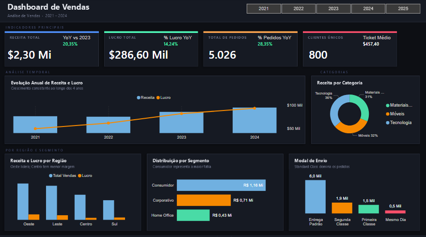
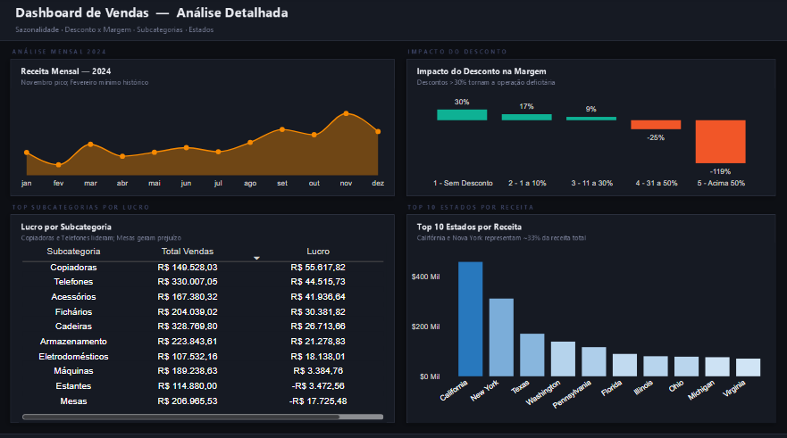

# Sales Analysis Dashboard
### Pipeline completo de análise de vendas — SQL · Power BI · DAX


---
## Dataset

Este projeto utiliza um conjunto de dados de vendas inspirado nos populares datasets “Superstore”, amplamente utilizados para estudos de Business Intelligence, SQL e Power BI.

Os dados passaram por etapas de limpeza, transformação e modelagem utilizando SQL e Power BI, com foco em análise de vendas, lucro, pedidos e indicadores de desempenho (KPIs).

Fonte de referência:
https://www.kaggle.com/datasets/fatihilhan/global-superstore-dataset

---
## Índice

1. [Objetivo](#-objetivo)
2. [Fonte de Dados](#-fonte-de-dados)
3. [Etapas do Projeto](#-etapas-do-projeto)
4. [Procedimentos](#-procedimentos)
5. [Análise Exploratória](#-análise-exploratória)
6. [Layout de Fundo do Dashboard](#-layout-de-fundo-do-dashboard)
7. [Visualizações](#-visualizações)
8. [Medidas DAX](#-medidas-dax)
9. [Insights](#-insights)
10. [Recomendações](#-recomendações)

---

## Objetivo

Desenvolver um dashboard interativo e profissional de ponta a ponta, cobrindo todas as etapas de um projeto real de Business Intelligence: da extração e limpeza dos dados no SQL até a visualização final no Power BI, com medidas DAX para análise de desempenho de vendas entre 2021 e 2024.

O projeto tem como finalidade demonstrar competências em:
- Limpeza e transformação de dados com SQL
- Modelagem de dados com Star Schema no Power BI
- Criação de métricas de negócio com DAX
- Design de dashboards interativos com filtros dinâmicos

---

## Fonte de Dados

| Item | Detalhe |
|---|---|
| **Dataset** | Sales Overview Data |
| **Período** | 2021 – 2024 |
| **Registros** | 10.018 linhas |
| **Mercado** | Estados Unidos |

**Colunas principais:**

`Order ID` · `Order Date` · `Ship Date` · `Ship Mode` · `Customer ID` · `Segment` · `Region` · `State/Province` · `Category` · `Sub-Category` · `Product Name` · `Sales` · `Quantity` · `Discount` · `Profit`

---

## Etapas do Projeto

```
 1. Ingestão        →  Carregamento do .xlsx no SQL Server
        │
 2. Limpeza         →  Remoção de nulos, duplicatas, padronização
        │
 3. Transformação   →  Colunas derivadas, views, faixas de desconto
        │
 4. Modelagem       →  Star Schema + Tabela Calendário no Power BI
        │
 5. DAX             →  KPIs, YoY, Margem, Ticket Médio, Faixas
        │
 6. Layout          →  Template dark no PowerPoint exportado como PNG
        │
 7. Dashboard       →  Visuais interativos com slicers dinâmicos
        │
 8. Publicação      →  GitHub + LinkedIn
```

---

## Procedimentos

### SQL — Limpeza e Transformação

```sql
-- Remoção de registros inválidos
SELECT *
FROM Sales_Overview_Data
WHERE order_date IS NOT NULL
  AND sales > 0
  AND customer_id IS NOT NULL;

-- Criação de colunas derivadas
SELECT
    order_id,
    customer_id,
    CAST(order_date AS DATE)            AS order_date,
    UPPER(TRIM(category))               AS category,
    sales,
    profit,
    ROUND(profit / NULLIF(sales, 0), 4) AS profit_margin,
    CASE
        WHEN discount = 0       THEN 'Sem Desconto'
        WHEN discount <= 0.10   THEN '1 a 10%'
        WHEN discount <= 0.30   THEN '11 a 30%'
        WHEN discount <= 0.50   THEN '31 a 50%'
        ELSE                         'Acima de 50%'
    END AS faixa_desconto
FROM Sales_Overview_Data
WHERE order_date IS NOT NULL
  AND sales > 0;

-- Transformação de colunas e valores
DROP TABLE IF EXISTS dados_tratados; 

-- PADRONIZAÇÃO DE COLUNAS
CREATE TABLE dados_tratados AS 
SELECT 
    "Row ID"            AS id_linha,
    "Order ID"          AS id_pedido,
    "Order Date"  		AS data_pedido,
    "Ship Date"		   	AS data_entrega,
    "Ship Mode"         AS tipo_entrega,
    "Customer ID"		AS cliente_id,
    "Segment"           AS segmento,
    "Country/Region"    AS pais,
    "City"              AS cidade,
    "State/Province"    AS estado, 
    "Region"            AS regiao,
    "Product ID"        AS id_produto,
    "Category"          AS categoria,
    "Sub-Category"      AS subcategoria,
    "Product Name"      AS nome_produto,
    "Customer Name"     AS nome_cliente,
    Sales               AS vendas,
    Profit              AS lucro,
    Quantity            AS quantidade,
    Discount            AS desconto  
FROM sales_overview_data;

-- Validação
SELECT *
FROM dados_tratados
LIMIT 10;

--- Padronização do conteudo
SELECT DISTINCT segmento FROM dados_tratados;
SELECT DISTINCT categoria FROM dados_tratados;
SELECT DISTINCT subcategoria FROM dados_tratados;
SELECT DISTINCT regiao FROM dados_tratados;
SELECT DISTINCT tipo_entrega FROM dados_tratados;

DROP TABLE IF EXISTS dados_finais;

CREATE TABLE dados_finais AS
SELECT
	id_linha,
	id_pedido,
	data_pedido,
	data_entrega,
	cliente_id,
--- =====================	
--- TRADUÇÃO DE VALORES
--- =====================		

-- Tipo entrega
	CASE 
		WHEN tipo_entrega = "Standard Class" THEN "Entrega Padrão"
		WHEN tipo_entrega = "Second Class" THEN "Segunda Classe"
        WHEN tipo_entrega = "First Class" THEN "Primeira Classe"
        WHEN tipo_entrega = "Same Day" THEN "Mesmo Dia"
        ELSE tipo_entrega
    END AS tipo_entrega,
    
-- Segmento
    CASE 
        WHEN segmento = "Consumer" THEN "Consumidor"
        WHEN segmento = "Corporate" THEN "Corporativo"
        WHEN segmento = "Home Office" THEN "Home Office"
        ELSE segmento
    END AS segmento,
    
 -- Categoria
    CASE 
        WHEN categoria = "Furniture" THEN "Móveis"
        WHEN categoria = "Technology" THEN "Tecnologia"
        WHEN categoria = "Office Supplies" THEN "Materiais de Escritório"
        ELSE categoria
    END AS categoria,
    
-- Subcategoria 
	CASE 
	    WHEN subcategoria = "Accessories" THEN "Acessórios"
	    WHEN subcategoria = "Appliances" THEN "Eletrodomésticos"
	    WHEN subcategoria = "Art" THEN "Arte"
	    WHEN subcategoria = "Binders" THEN "Fichários"
	    WHEN subcategoria = "Bookcases" THEN "Estantes"
	    WHEN subcategoria = "Chairs" THEN "Cadeiras"
	    WHEN subcategoria = "Copiers" THEN "Copiadoras"
	    WHEN subcategoria = "Envelopes" THEN "Envelopes"
	    WHEN subcategoria = "Fasteners" THEN "Fixadores"
	    WHEN subcategoria = "Furnishings" THEN "Decoração"
	    WHEN subcategoria = "Labels" THEN "Etiquetas"
	    WHEN subcategoria = "Machines" THEN "Máquinas"
	    WHEN subcategoria = "Paper" THEN "Papel"
	    WHEN subcategoria = "Phones" THEN "Telefones"
	    WHEN subcategoria = "Storage" THEN "Armazenamento"
	    WHEN subcategoria = "Supplies" THEN "Suprimentos"
	    WHEN subcategoria = "Tables" THEN "Mesas"
	    ELSE subcategoria
	END AS subcategoria,
	
-- Região	
	CASE 
        WHEN regiao = 'South' THEN 'Sul'
        WHEN regiao = 'West' THEN 'Oeste'
        WHEN regiao = 'Central' THEN 'Centro'
        WHEN regiao = 'East' THEN 'Leste'
        ELSE regiao
    END AS regiao,

-- ======================
-- RESTANTE
-- ======================
    pais,
    cidade,
    estado,
    id_produto,
    nome_produto,
    nome_cliente,
    vendas,
    lucro,
    quantidade,
    desconto
FROM dados_tratados;

--- Validação de valores da tabela final
SELECT * FROM dados_finais;

SELECT DISTINCT tipo_entrega FROM dados_finais;
SELECT DISTINCT segmento FROM dados_finais;
SELECT DISTINCT	categoria FROM dados_finais;
SELECT DISTINCT	subcategoria FROM dados_finais;
SELECT DISTINCT	regiao FROM dados_finais;

```

### Power BI — Modelagem

- Importação dos dados via **Power Query**
- Criação da **Tabela Calendário** com colunas: `Date`, `Ano`, `Mes`, `Nome Mes`, `Numero Mes`, `Trimestre`
- Tabela Calendário marcada como **Tabela de Datas**
- Relacionamento: `Calendário[Date]` → `Vendas[Order Date]` (1:N)
- Modelo no formato **Star Schema**

### Power BI — Coluna Calculada para Faixas de Desconto

```dax
Faixa Desconto =
SWITCH(TRUE(),
    dados_finais[Discount] = 0,       "1 - Sem Desconto",
    dados_finais[Discount] <= 0.10,   "2 - 1 a 10%",
    dados_finais[Discount] <= 0.30,   "3 - 11 a 30%",
    dados_finais[Discount] <= 0.50,   "4 - 31 a 50%",
    "5 - Acima de 50%"
)
```

---

## Análise Exploratória

### Resumo Geral

| Métrica | Valor |
|---|---|
| 💰 Receita Total | $ 2.298.896 |
| 📈 Lucro Total | $ 286.599 |
| 🛒 Total de Pedidos | 5.026 |
| 👥 Clientes Únicos | 800 |
| 📊 Margem Geral | 12,5% |
| 🎫 Ticket Médio | $ 457,40 |

### Evolução Anual

| Ano | Receita | Lucro | Pedidos |
|---|---|---|---|
| 2021 | $ 484.439 | $ 49.523 | 973 |
| 2022 | $ 470.647 | $ 61.575 | 1.041 |
| 2023 | $ 609.861 | $ 81.917 | 1.319 |
| 2024 | $ 733.948 | $ 93.583 | 1.693 |
| **YoY 2024** | **+20,35%** | **+14,24%** | **+28,35%** |

### Por Categoria

| Categoria | Receita | Margem |
|---|---|---|
| Tecnologia | $ 836.154 | 17,4% |
| Móveis | $ 742.714 | 2,5% |
| Material de Escritório | $ 720.029 | 13,6% |

### Impacto do Desconto na Margem

| Faixa de Desconto | Margem Média |
|---|---|
| Sem Desconto | +30,0% |
| 1 a 10% | +17% |
| 11 a 30% | +9% |
| 31 a 50% | -25% |
| Acima de 50% | -119% |

---

## Layout de Fundo do Dashboard

O layout dark foi criado no **Microsoft PowerPoint** e exportado como imagem PNG para ser usado como plano de fundo no Power BI.

### Como foi feito

1. Configuração do slide no formato **Widescreen 16:9**
2. Fundo da página com cor `#0D0F14`
3. Containers criados com **formas retangulares**:
   - Preenchimento: `#161A23`
   - Borda: `#2A2F3D`
   - Cantos arredondados: 10px
   - Sombra externa com opacidade 28%
4. Barras coloridas no topo de cada card como indicadores visuais por categoria
5. Painel lateral esquerdo reservado para os slicers de filtro
6. Textos de placeholder indicando onde cada visual deve ser inserido
7. Exportado via **Arquivo → Exportar → PNG**
8. Importado no Power BI em **Formatar Página → Papel de Parede → Adicionar Imagem → Modo: Preencher**

### Página 1 — Visão Geral



### Página 2 — Análise Detalhada



---

## Visualizações

### Página 1 — Visão Geral

| Visual | Tipo | Campos |
|---|---|---|
| Receita Total | Cartão | `Receita Total` + `% Receita YoY` |
| Lucro Total | Cartão | `Lucro Total` + `% Lucro YoY` |
| Total de Pedidos | Cartão | `Total Pedidos` + `% Pedidos YoY` |
| Clientes Únicos | Cartão | `Clientes Únicos` + `Ticket Médio` |
| Evolução Anual | Coluna + Linha | Eixo: `Ano` · Coluna: `Receita Total` · Linha: `Lucro Total` |
| Receita por Categoria | Rosca | Legenda: `Category` · Valores: `Receita Total` |
| Receita por Região | Colunas | Eixo: `Region` · Valores: `Receita Total` + `Lucro Total` |
| Distribuição por Segmento | Barras | Eixo: `Segment` · Valores: `Receita Total` |
| Modal de Envio | Colunas | Eixo: `Ship Mode` · Valores: contagem de pedidos |

### Página 2 — Análise Detalhada

| Visual | Tipo | Campos |
|---|---|---|
| Receita Mensal 2024 | Linha | Eixo: `Nome Mes` · Valores: `Receita Total` · Filtro: Ano = 2024 |
| Impacto do Desconto | Colunas | Eixo: `Faixa Desconto` · Valores: `Média Margem %` |
| Lucro por Subcategoria | Tabela | `Sub-Category` · `Receita Total` · `Lucro Total` · `Margem %` |
| Top 10 Estados | Colunas | Eixo: `State/Province` · Valores: `Receita Total` · Top N: 10 |

### Filtros Interativos (Slicers)

| Filtro | Campo | Estilo |
|---|---|---|
| 📅 Ano | `Calendario[Ano]` | Bloco horizontal |
| 🗺️ Região | `dados_finais[Regiao]` | Lista |
| 👤 Segmento | `dados_finais[Segmento]` | Lista |
| 📦 Categoria | `dados_finais[Categoria]` | Lista |

---

## Medidas DAX

### KPIs Base

```dax
Receita Total = SUM(dados_finais[vendas])

Lucro Total = SUM(dados_finais[Lucro])

Total Pedidos = DISTINCTCOUNT(dados_finais[id_pedido])

Clientes Únicos = DISTINCTCOUNT(dados_finais[cliente_id])

Ticket Médio = DIVIDE([Receita Total], [Total Pedidos])

Margem % = DIVIDE([Lucro Total], [Receita Total])

Média Margem % = DIVIDE(SUM(dados_finais[Lucro]), SUM(dados_finais[vendas]))
```

### Crescimento Ano a Ano (YoY)

```dax
Receita Ano Anterior =
CALCULATE(
    [Receita Total],
    ALL('Calendario'),
    'Calendario'[Ano] = 2023
)

Lucro Ano Anterior =
CALCULATE(
    [Lucro Total],
    ALL('Calendario'),
    'Calendario'[Ano] = 2023
)

Pedidos Ano Anterior =
CALCULATE(
    [Total Pedidos],
    ALL('Calendario'),
    'Calendario'[Ano] = 2023
)

% Receita YoY =
VAR atual = CALCULATE([Receita Total], ALL('Calendario'), 'Calendario'[Ano] = 2024)
VAR anterior = [Receita Ano Anterior]
RETURN DIVIDE(atual - anterior, anterior)

% Lucro YoY =
VAR atual = CALCULATE([Lucro Total], ALL('Calendario'), 'Calendario'[Ano] = 2024)
VAR anterior = [Lucro Ano Anterior]
RETURN DIVIDE(atual - anterior, anterior)

% Pedidos YoY =
VAR atual = CALCULATE([Total Pedidos], ALL('Calendario'), 'Calendario'[Ano] = 2024)
VAR anterior = [Pedidos Ano Anterior]
RETURN DIVIDE(atual - anterior, anterior)
```

### Formatação com Símbolo de Dólar

```dax
Receita Total $ = "$ " & FORMAT([Receita Total], "#,##0.00")

Lucro Total $   = "$ " & FORMAT([Lucro Total], "#,##0.00")

Ticket Médio $  = "$ " & FORMAT([Ticket Médio], "#,##0.00")
```

---

## Insights

**1. Crescimento acelerado em 2024**
A receita cresceu **+20,35%** e os pedidos **+28,35%** em relação a 2023 — o maior crescimento dos 4 anos analisados, indicando expansão sólida da operação.

**2. Tecnologia é a categoria mais rentável**
Com margem de **17,4%**, Tecnologia supera Móveis (2,5%) e Material de Escritório (13,6%). Produtos de tecnologia devem ser priorizados em estratégias de mix de vendas.

**3. Móveis: alto volume, baixa rentabilidade**
Apesar de ser a segunda categoria em receita ($742K), Móveis tem margem crítica de apenas **2,5%** — qualquer aumento de custo pode tornar a categoria deficitária.

**4. Descontos acima de 30% destroem o lucro**
A margem vai de **+30%** sem desconto para **-119%** acima de 50% de desconto. Descontos excessivos são o principal vilão da rentabilidade do negócio.

**5. Fevereiro é estruturalmente o mês mais fraco**
Em todos os 4 anos analisados, fevereiro registra a menor receita mensal. Em 2024 foram apenas $20.301 — contra $118.448 em novembro. É sazonalidade recorrente, não anomalia.

**6. Concentração geográfica elevada**
Califórnia ($457K) e Nova York ($310K) juntas representam **~33% de toda a receita**, gerando risco de dependência regional.

**7. Standard Class domina os envios**
Cerca de **60% dos pedidos** usam Entrega Padrão. O modelo Mesmo Dia representa apenas 5% — possível oportunidade de receita adicional com frete expresso premium.

---

## Recomendações

**1. Revisar política de descontos**
Estabelecer teto de **20% de desconto máximo**. Descontos acima de 30% devem exigir aprovação gerencial — a análise mostra que são sistematicamente deficitários.

**2. Estratégia de mix para Móveis**
Revisar o pricing da categoria ou reduzir custos operacionais. Com margem de 2,5%, qualquer variação de frete ou devolução elimina o lucro inteiro da categoria.

**3. Expandir presença geográfica**
Investir em marketing fora de Califórnia e Nova York para reduzir concentração. Texas ($170K) e Washington ($138K) mostram potencial relevante de crescimento.

**4. Aproveitar a sazonalidade**
Planejar campanhas para **fevereiro e janeiro** — meses historicamente fracos — e garantir estoque reforçado para **novembro**, pico consistente de vendas.

**5. Potencializar Tecnologia**
Categoria com melhor margem (17,4%) e crescimento consistente. Ampliar portfólio e criar bundles com Material de Escritório pode elevar o ticket médio por pedido.

**6. Explorar frete expresso**
Criar uma oferta estruturada de entrega Same Day com margem premium pode aumentar receita sem aumentar volume de pedidos.

---

## Tecnologias Utilizadas

- **SQL Server** — limpeza, transformação e modelagem dos dados brutos
- **Power BI Desktop** — modelagem Star Schema, tabela calendário e dashboard interativo
- **DAX** — KPIs, inteligência de tempo (YoY), margens e formatação
- **Microsoft PowerPoint** — criação do layout dark exportado como fundo PNG
- **Git / GitHub** — versionamento do projeto

---

## Estrutura do Repositório

```
sales-analysis-powerbi/
│
├── assets/images
│   ├── dashboardP1-vendas.png    ← Print da Página 1
│   ├── dashboardP2-vendas.png    ← Print da Página 2
│   ├── slide1.png                ← Print ppt 1
|   └── slide2.png                ← Print ppt 2 
|
├── assets/dataset
|   └── Sales Overview Data.xlsx
|
├── sql/
│   ├── 01_exploracao.sql
│   ├── 02_qualidade.sql
│   └── 03_transformacao.sql
│
├── dashboard.pbix                ← Arquivo Power BI
└── README.md
```

---

*Projeto de portfólio · Análise de Dados · SQL · Power BI · DAX*
